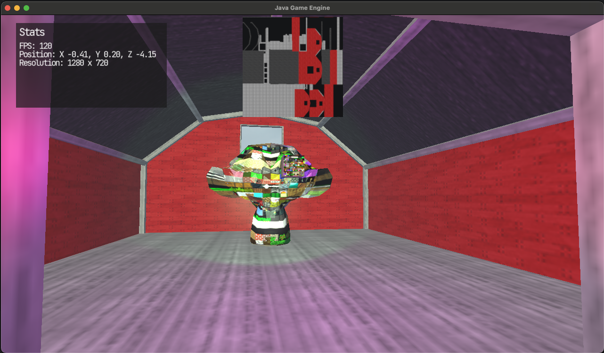

# JavaGameEngine
A simple Java game engine using LWJGL 3 and some of my own implementations

## Includes
- 3D rendering
- Lighting
- Custom shaders
- Simple UI
- Text rendering
- Post processing

## Examples
There is one simple demo scene that contains all of the implementations above

A thing I have been working on myself in this engine would be a simple procedural landscape generation.
Although it might be in a very early stage, it is working and keeping a consistent framerate without stutter on the chunk generation.

