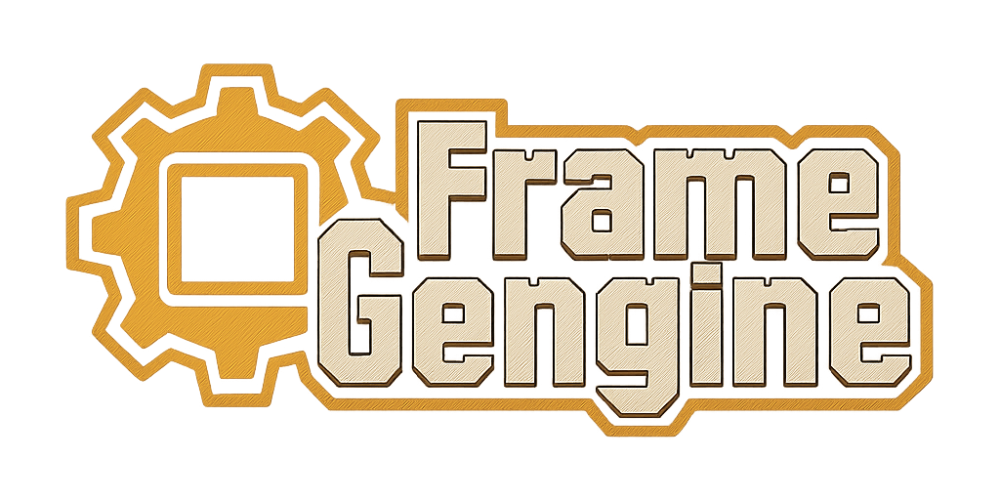
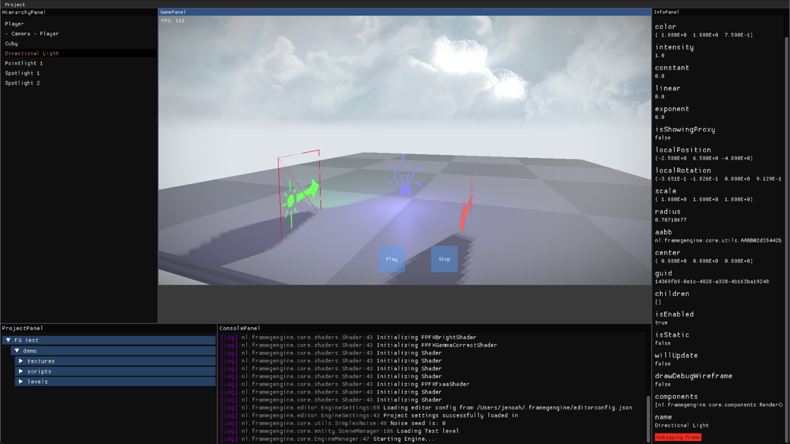

# Frame Gengine
A simple Java Game engine using LWJGL3 / OpenGL.

## Included features
- 3D rendering
- Simple editor
- Instanced rendering
- Game Object Components
- PBR lighting
- Directional shadows
- Custom shaders
- Fog
- Simple UI
- Text rendering (Credits to [Thin Matrix's font rendering tutorial](https://www.youtube.com/watch?v=mnIQEQoHHCU))
- Post-processing
- Debug boxes

## Planned features
- Point- and spotlight shadows
- Collisions
- Ambient Occlusion
- Reflections
- Expanding UI to buttons
- Audio
- Occlusion culling

## How to run
- Run the 'Editor/EditorLauncher.java'
- If on Mac, use the file mentioned above with the '-XstartOnFirstThread' VM parameter

## Examples
All the above-mentioned included features are shown in the demo scene. The previews below might be outdated.
This demo scene includes a procedurally generated world. This is done with chunks of [Marching Cubes](https://en.wikipedia.org/wiki/Marching_cubes) that runs on a separate thread to prevent stuttering on generation.

