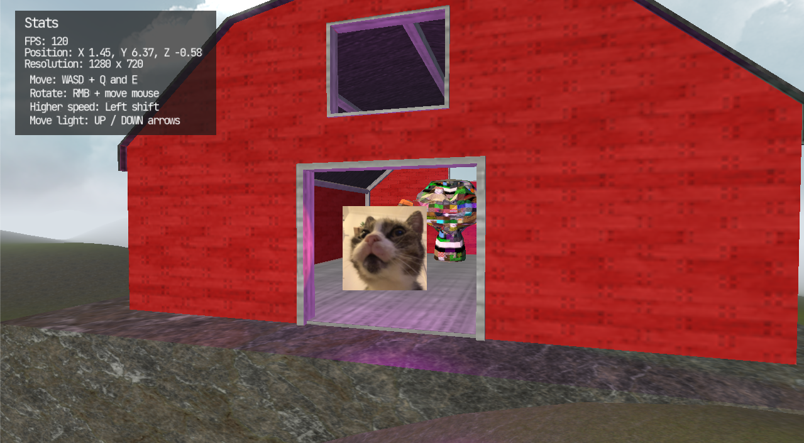

# JavaGameEngine
A simple Java game.myGame engine using LWJGL 3 and some of my own implementations

## How to run
- Run the 'Demo/DemoLauncher.java'
- If on Mac, use the file mentioned above with the '-XstartOnFirstThread' VM parameter

## Includes
- 3D rendering
- Simple lighting
- Custom shaders
- Simple UI
- Text rendering(Credits to [Thin Matrix's font rendering tutorial](https://www.youtube.com/watch?v=mnIQEQoHHCU))
- Post processing
- Marching cubes, multi-threaded terrain generation

## Examples
### **_Pictures below are outdated_**

There is one simple game demo scene that contains all the implementations above

A thing I have been working on myself in this engine would be a simple procedural landscape generation.
Although it might be in a very early stage, it is working and keeping a consistent framerate without stutter on the chunk generation.

    

